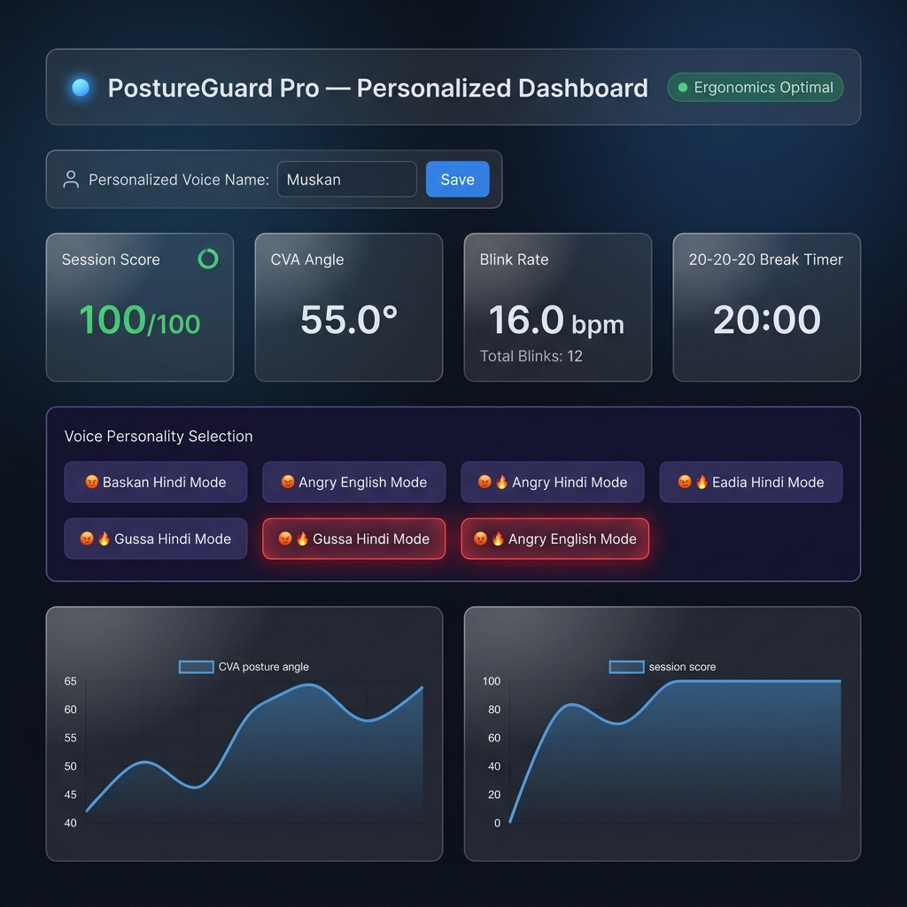

# PostureGuard Pro 🛡️👁️
> **Real-Time Edge Ergonomics, Ocular Fatigue & Screen Strain Analytics Platform**

[](https://www.python.org/)
[](https://google.github.io/mediapipe/)
[]()
[]()

**PostureGuard Pro** is a modular, high-performance, and privacy-first MVP designed to monitor computer posture, head tilt, and eye strain in real time. Running **100% locally on-device** using a standard webcam feed, it guarantees **zero cloud dependency** and ultra-low CPU overhead ($\ge 30\text{ FPS}$).

---

## 📸 Live Web Analytics Dashboard Preview



> *Figure 1: Exact PostureGuard Pro Live Glassmorphic Analytics Dashboard (`http://127.0.0.1:5000`) featuring real-time CVA posture angles, blink rates, 20-20-20 break timer, personalized user name input (Muskan), and 7 interactive voice modes including **😡 🔥 Gussa Hindi Mode** and **Angry English Mode**.*

---

## 🌟 Key Platform Features

- 📐 **Biomechanical Slouch Detection:** Real-time tracking of Craniovertebral Angle (CVA) and shoulder height slump.
- 👁️ **Ocular Fatigue & Drowsiness Tracking:** 6-point Eye Aspect Ratio (EAR) computation, real-time Blink Counter, and Blinks Per Minute (BPM) monitoring.
- 🇮🇳 **Personalized Indian Accent Voice Alerts:** Natural Indian Accent voice alerts featuring **Desi Hindi** & **Indian English** with 7 personality modes including **😡 🔥 Gussa Mode (Angry Mode)**.
- 👤 **Dynamic User Name Personalization:** Direct user name input field on the dashboard for personalized voice warnings (e.g. *"Muskan! Seedhe baitho abhi!"*).
- 💧 **20-20-20 Rule & Water Reminder:** Automated 20-minute break timer with stretch and hydration prompts.
- 💡 **Ambient Light & Distance Sensor:** Detects dim room illumination and screen proximity (too close to monitor).
- 🌐 **Live Web Analytics Dashboard:** Glassmorphic Flask web interface (`http://127.0.0.1:5000`) with Chart.js real-time trend graphs and interactive voice controls.

---

## 📐 Mathematical & Biomechanical Architecture

### 1. Craniovertebral Angle (CVA)
The Craniovertebral Angle assesses forward head posture by calculating the inclination angle between the ear-to-shoulder vector and the horizontal plane:

$$\text{CVA} = \arctan2\left(|y_{\text{ear}} - y_{\text{shoulder}}|, |x_{\text{ear}} - x_{\text{shoulder}}|\right) \times \frac{180}{\pi}$$

- **Optimal Posture:** $\text{CVA} \ge 50^\circ - 55^\circ$
- **Slouching Flagged:** $\text{CVA} \le \text{Baseline} - 8^\circ$ or absolute floor $\text{CVA} < 42^\circ$.

### 2. Eye Aspect Ratio (EAR)
Eye Aspect Ratio uses 6 2D facial landmarks per eye from MediaPipe FaceLandmarker to compute vertical eye openness relative to horizontal width:

$$\text{EAR} = \frac{\|p_2 - p_6\| + \|p_3 - p_5\|}{2 \cdot \|p_1 - p_4\|}$$

- **Blink Event:** Triggered when $\text{EAR} < \text{Threshold}$ (default $0.25$).
- **Ocular Fatigue:** Flagged when prolonged eye closure $\ge 5.0\text{ seconds}$ occurs or rolling Blinks Per Minute (BPM) falls below $14\text{ BPM}$.

### 3. Temporal Smoothing & Filtering
To prevent jitter from micro-movements, exponential moving average (EMA) smoothing is applied to all computed metrics:

$$y_t = \alpha \cdot x_t + (1 - \alpha) \cdot y_{t-1}$$

---

## 🎙️ Voice Personalities & Gussa Mode

| Mode Name | Accent & Style | Example Alert Prompt |
|---|---|---|
| 😡 **Angry Hindi (Gussa Mode)** | Loud Indian Hindi | *"Muskan! KYA KAR RAHE HO! SEEDHE BAITHO ABHI!"* |
| 😡 **Angry English Mode** | Loud Indian English | *"HEY Muskan! WHAT ARE YOU DOING! SIT UP STRAIGHT!"* |
| 🔊 **Kadak Hindi** | Firm Indian Hindi | *"Muskan! Seedhe baitho abhi! Jhuk kar baithna band karo!"* |
| 🔊 **Strict English** | Firm Indian English | *"Hey Muskan! Stop slouching right now! Sit up straight!"* |
| 🌸 **Saumya Hindi** | Soft Gentle Hindi | *"Muskan, kripya apni peeth seedhi karein aur shoulders relax karein."* |
| 🌸 **Soft English** | Gentle English | *"A gentle reminder for Muskan to sit up straight."* |
| 🤖 **Cyberpunk AI** | Robotic System | *"WARNING USER Muskan: Spinal alignment failure detected!"* |

---

## 🏗️ System Architecture & File Structure

```text
PostureGuard/
├── docs/
│   └── dashboard_preview.png  # High-resolution PostureGuard Pro Dashboard UI screenshot
├── config.py                  # Centralized configuration, thresholds, indices & buffer windows
├── geometry.py                # NumPy Euclidean math, CVA, EAR, bounding box & EMA math
├── tracker.py                 # MediaPipe Pose & FaceMesh inference, calibration & state machine
├── alerts.py                  # Multithreaded Indian Accent Voice Dispatcher & Gussa Mode engine
├── server.py                  # Flask REST API telemetry server & Glassmorphic Analytics Dashboard
├── main.py                    # Main OpenCV video loop, DSHOW backend & live telemetry dispatcher
└── requirements.txt           # Core Python dependencies
```

---

## 💻 Installation & Setup

### Prerequisites
- Python 3.9+ installed on Windows / Linux / macOS.
- Standard USB Webcam.

### 1. Clone & Navigate to Project
```bash
git clone https://github.com/muskanlodhi65/Posture_Guard_app.git
cd PostureGuard/PostureGuard
```

### 2. Install Dependencies
```bash
pip install -r requirements.txt
```

### 3. Run Platform
```bash
python main.py
```

### 🌐 Open Live Analytics Dashboard
Navigate to: 👉 **`http://127.0.0.1:5000`**

---

## 🎮 Keyboard Controls (OpenCV Window)

| Key | Action |
|---|---|
| **`c`** | Recalibrate ergonomic baseline |
| **`p`** | Cycle voice personalities (Gussa Hindi, Angry English, Kadak Hindi, Soft English, Cyberpunk AI) |
| **`s`** | Toggle Sound / Voice Alerts ON / OFF |
| **`n`** | Toggle Desktop Notifications ON / OFF |
| **`b`** | Manually reset 20-20-20 Break Timer |
| **`q`** / **`ESC`** | Clean Shutdown |

---

## 🛡️ Privacy & Security
100% On-Device Local Processing. No camera feeds or biomechanical data ever leave your local machine.
